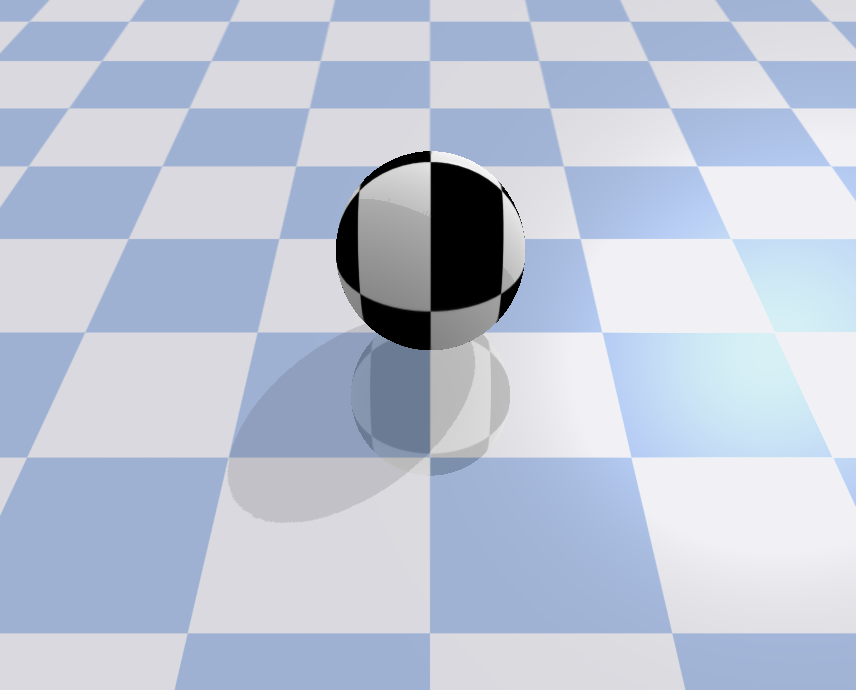
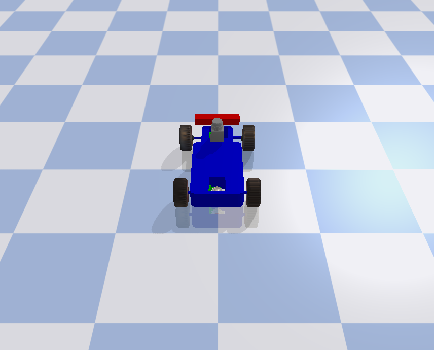
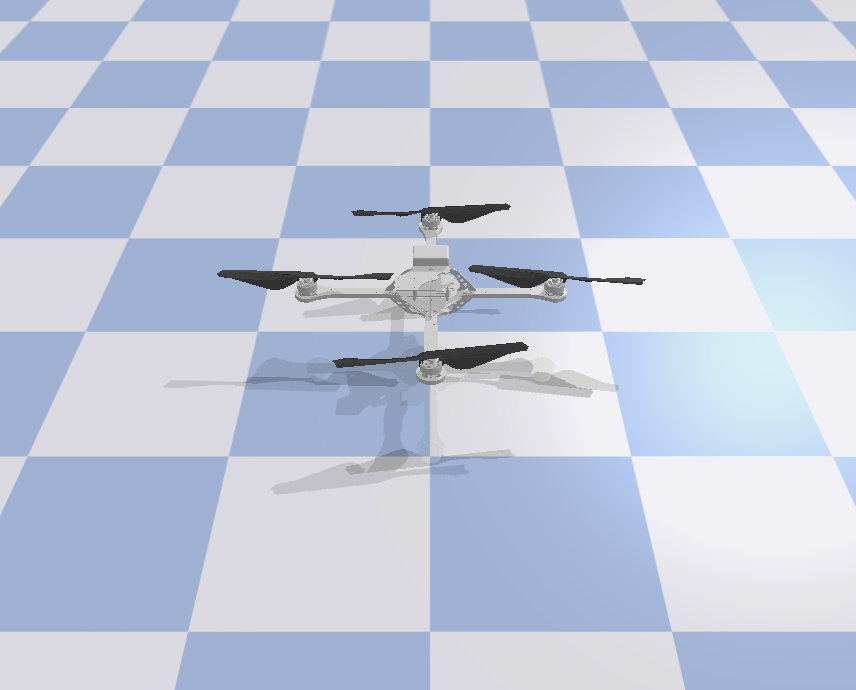

# Agents

We have implemented the following agents (agents marked with an asterix are available in all tasks):

- **Ball**:
The ball is a spherical shaped agent which can freely move on the xy-plane. 
Observation space is $\mathbb{R}^9$ containing the position 
$x \in \mathbb{R}^3$, velocity $\dot{x} \in \mathbb{R}^3$ and rotation speed 
$\dot{\vartheta} \in \mathbb{R}^3$. Note that orientation does not matter due 
its shape. Actions are applied as forces in (x,y) world coordinates, 
i.e. $U \subset R^2$

- **Car**: A four-wheeled agent based on MIT's Racecar. The car has a simplified control scheme   $U = (\eta, \alpha) \subset \mathbb{R}^2$ where $\eta$ is the target wheel velocity for all whells and $\alpha$ is the target steering angle. Observations are in $\mathbb{R}^6$ with the xy-position $x \in \mathbb{R}^2$, xy-velocity $\dot{x} \in \mathbb{R}^2$ and rotation speed  $\dot{\vartheta} \in \mathbb{R}^3$.  (xy, xy_dot, sin(yaw), cos(yaw))$ where the trigonometric functions are used to disambiguate rotational information and bring it into the range [-\pi, \pi]

- **Drone**: An air vehicle based on the AscTec Hummingbird quadrotor. 
The rotors are velocity-controlled $U \subset \mathbb{R}^{4}$. The state space is $\mathbb{X} \subset \mathbb{R}^{17}$.

- **Ant**: The ant is a quadrupedal agent composed of nine rigid links, including a torso and four legs. Each leg consists of two actuators which are controlled based on torques. The observation space includes the position, orientation and (orientation-) velocities of the torso, the angular position and velocity for each of the 8 actuators and contact information of the foots. Overall the observation space is of size: 3+3+6+3 + 16 + 4 = 35

Ball | Car | Drone | Ant
--- | ---| ---| ---
 |||

